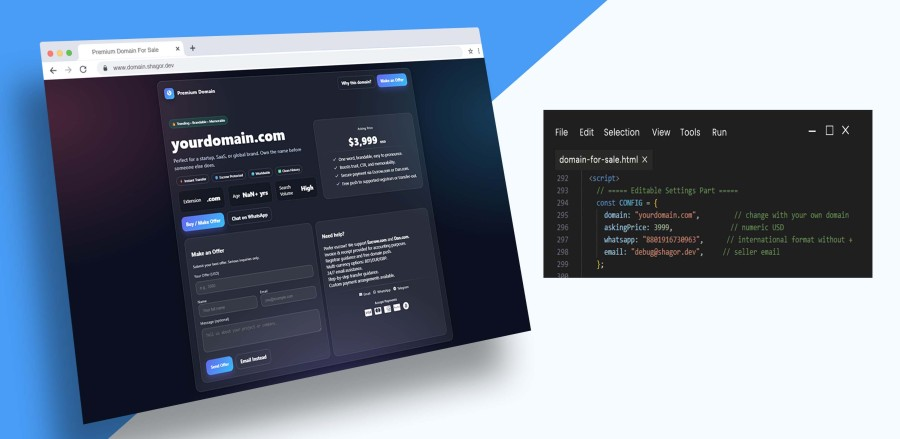

# Premium Domain Landing Page - html

A clean, modern, and responsive landing page template for showcasing a premium domain for sale. This template is fully client-side and comes with built-in contact options, structured data for SEO, and visually appealing design using glassmorphism and gradients.

---

## 🚀 Features
- **Responsive Design:** Works seamlessly on desktop, tablet, and mobile devices.  
- **Hero Section:** Prominently displays the domain name with a shining effect and key selling points.  
- **Price & Features Card:** Highlights asking price and domain benefits.  
- **Contact Form:** Allows users to submit offers via email.  
- **Instant Communication:** Quick links to WhatsApp, Telegram, and Email.  
- **Escrow Support:** Highlights safe payment options like Escrow.com and Dan.com.  
- **Structured Data:** JSON-LD for Google Product rich snippets.  
- **Modern Styles:** Glassmorphism effect, gradient backgrounds, and subtle animations.  
- **Customizable Settings:** Easily change domain name, price, contact info, and creation year in the script.

---

## Demo

## 📦 Installation
**Clone the repository:** `domain-for-sale-dynamic-landing-page`
- Open `index.html` in a browser to view the landing page.
- Customize your domain settings in the `<script>` section:

`domain: "yourdomain.com",
  askingPrice: 3999,
  whatsapp: "8801916730963",
  email: "debug@shagor.dev",`
- Update domain age by setting `createdYear`:

`const createdYear = 2020; // Year the domain was created`
- Replace images and favicon as needed: `preview.jpg` – Open Graph image for social sharing. `favicon.ico` – Browser favicon.

## Technologies Used
- HTML5 & CSS3
- JavaScript (Vanilla)
- FontAwesome Icons
- JSON-LD structured data

## Contact & Support
Raisul Islam
- Email: debug@shagor.dev
- WhatsApp: [Chat Now](https://api.whatsapp.com/message/5VQWI3F5ZF4PD1)
- Telegram: [Send Message](https://t.me/shagor447)

---

This project is licensed under the MIT License. See the LICENSE file for details.
